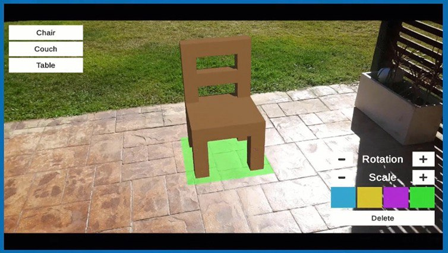

# AR Furniture Placement Project

This project allows users to place virtual furniture objects, such as a chair, a couch, or a table, in an augmented reality (AR) environment. The furniture objects are displayed on the user's phone, superimposed on the real-world view captured by the device's camera.

## Getting Started

These instructions will help you get a copy of the project up and running on your local machine for development and testing purposes.

### Prerequisites

- Unity 3D (version XYZ or higher)
- AR Foundation package
- ARCore (for Android) or ARKit (for iOS) support
- Android or iOS device with AR capabilities

### Installing

1. Clone the repository to your local machine using the following command:
git clone https://github.com/AbdoRezki/Retail-AR-Application.git

2. Open Unity and select "Open Project." Browse to the cloned repository's folder and select it to open the project.

3. Once the project is opened in Unity, ensure that you have the necessary AR packages installed. If not, navigate to Unity's Package Manager and install the AR Foundation package along with the appropriate AR platform support package (ARCore for Android or ARKit for iOS).

4. Connect your Android or iOS device to your computer and set it up for development/testing with Unity.

5. Set up the AR build settings for your target platform (Android or iOS) by going to `File -> Build Settings`. Make sure to select the appropriate platform and adjust any other required settings.

6. Build and deploy the project to your connected device by clicking on the "Build and Run" button in the Unity editor.

## Usage

1. Launch the application on your device, and it will activate the camera feed.

2. Aim the camera at a suitable surface (e.g., floor or table) where you want to place the virtual furniture.

3. Select the desired furniture object from the available options (chair, couch, or table) using the interface on the phone.

4. To remove the furniture object, simply tap on the "Destroy" button or gesture.

## Contributing

Contributions to this project are welcome. To contribute, follow these steps:

1. Fork the repository.

2. Create a new branch for your feature or bug fix.

3. Make the necessary changes and ensure that the project builds successfully.

4. Write appropriate tests for your changes, if applicable.

5. Submit a pull request, describing your changes in detail and outlining the motivation and impact of your contribution.

## License

This project is licensed under the [MIT License](https://opensource.org/licenses/MIT) - see the [LICENSE.md](LICENSE.md) file for details.

## Acknowledgments

- This project was inspired by the idea of allowing users to visualize furniture in their living spaces before purchasing.
- The AR functionality is implemented using Unity's AR Foundation package.
- Special thanks to the open-source community for providing valuable resources and tutorials.
